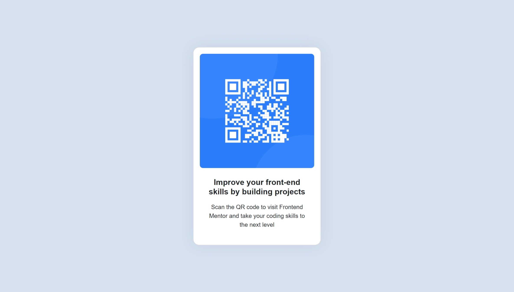

# Frontend Mentor - QR code component solution

This is a solution to the [QR code component challenge on Frontend Mentor](https://www.frontendmentor.io/challenges/qr-code-component-iux_sIO_H). Frontend Mentor challenges help you improve your coding skills by building realistic projects. 

## Table of contents

- [Overview](#overview)
  - [Screenshot](#screenshot)
  - [Links](#links)
- [My process](#my-process)
  - [Built with](#built-with)
  - [What I learned](#what-i-learned)
  - [Continued development](#continued-development)
  - [Useful resources](#useful-resources)
- [Author](#author)
- [Acknowledgments](#acknowledgments)

**Note: Delete this note and update the table of contents based on what sections you keep.**

## Overview

### Screenshot



### Links

- Solution URL: [Add solution URL here](https://github.com/Higokian/qr-code-component)
- Live Site URL: [Add live site URL here](https://qrcodejr.netlify.app/)

## My process

### Built with

- Semantic HTML5 markup
- CSS custom properties
- [Bootstrap 5](https://getbootstrap.com/) - CSS library

### What I learned

I'm feeling a bit more comfortable using bootstrap after this project. I got stumped trying to get the card to center horizontally and vertically. I'm sure there are
better solutions to this, but did come up with this:

```html
  <body class="d-flex flex-column justify-content-center">
    <div class="container d-flex justify-content-center">
      <div class="card">
```


### Continued development

The biggest thing I want to focus getting more comfortable with is nesting. I currently struggle to gauge how many layers are necessary. I think that mastering
this would increase my coding efficiency significantly.


### Useful resources

- [Bootstrap 5 docs](https://getbootstrap.com/docs/5.3/getting-started/introduction/) - This helps tremendously. Nearly all your answers can be found here. I mostly used it as a kind of cheat sheet
- [Bing] - Bing (AI) helps a lot with things that I can't find answers for elsewhere. At one point my card had a large margin on the right side and I couldn't find the cause using developer tools. Bing gave me very helpful suggestions and helped me pinpoint the issue.
- [Stack Overflow](https://stackoverflow.com/) - Probably one of the most important resources for any developer. Stack Overflow contains solutions to most issues.


## Author

- Frontend Mentor - [@Higokian](https://www.frontendmentor.io/profile/Higokian)
- LinkedIn - [Jason Ritter](https://www.linkedin.com/in/jason-ritter-891b36145/)

## Acknowledgments

Shoutout to Ryan ([@RW2023](https://www.frontendmentor.io/profile/RW2023)) for showing his completed version of this project. It inspired me to complete it!

